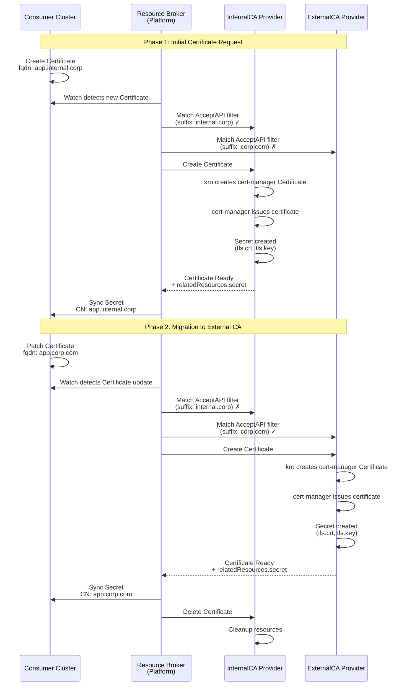

# Brokering Certificates

This example uses resource-broker to broker Certificate resources from
a consumer cluster to matching provider clusters.

## Overview

The resource-broker runs in the platform cluster and connects to the
consumer and provider clusters directly.

The Certificate resources in the provider clusters are backed by
cert-manager and kro.

## Prerequisites

### Required Tools

- docker
- kind
- kubectl
- helm
- yq
- go

## Components

### Consumer Cluster

The consumer cluster has the `Certificate` CRD installed.

### Provider Clusters (InternalCA & ExternalCA)

Each provider cluster runs kro and cert-manager to back the `Certificate` resource with self-signed issuers.

They each configure an `AcceptAPI` resource to declare under which constraints they will be able to serve `Certificate` resources from consumers:

```yaml
apiVersion: broker.platform-mesh.io/v1alpha1
kind: AcceptAPI
metadata:
  name: certificates.example.platform-mesh.io
spec:
  # which resource this AcceptAPI applies to
  # a provider can have multiple AcceptAPIs for the same resource with
  # different filters
  gvr:
    group: example.platform-mesh.io
    version: v1alpha1
    resource: certificates
  filters:
    # Filter on FQDN suffix
    - key: fqdn
      suffix: internal.corp
```

The resource-broker caches these and uses them to route requests.

## Running the Example

1. Setup the kind clusters and install components

```bash
./examples/certs/run.bash setup
```

2. Build and start the resource-broker in the platform cluster

```bash
./examples/certs/run.bash start-broker
```

3. Run the example scenario

```bash
./examples/certs/run.bash run-example
```

<!--
TODO: Split up run-example into smaller steps to show them here with explanations.
-->

This creates a Certificate in the consumer cluster, waits until it is
served by a provider and then modifies it to trigger a migration to
another provider.



4. (Optional) Clean up resources created during the example

```bash noci
./examples/certs/run.bash cleanup
./examples/certs/run.bash stop-broker
```

Or delete the clusters:

```bash
kind delete cluster --name broker-platform
kind delete cluster --name broker-consumer
kind delete cluster --name broker-internalca
kind delete cluster --name broker-externalca
```
