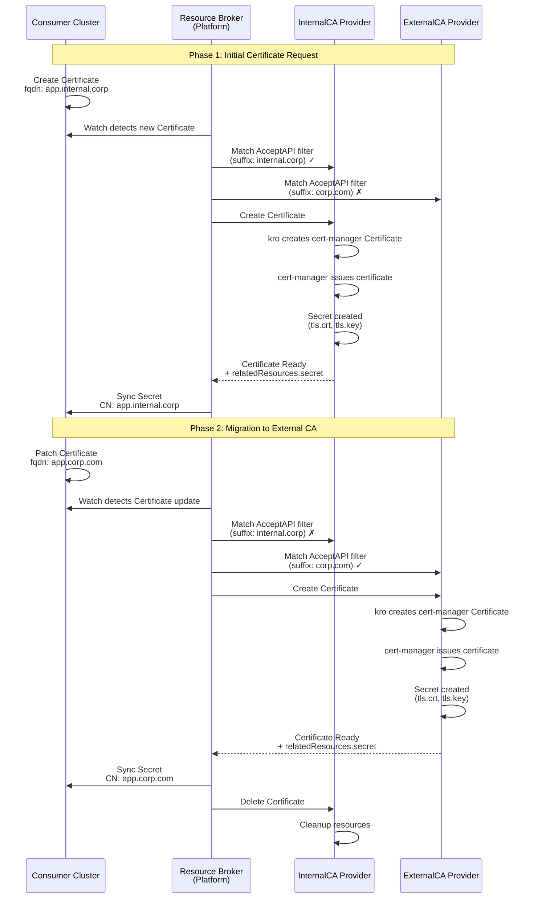

# Brokering Certificates

This example uses resource-broker to broker Certificate resources from
a consumer cluster to matching provider clusters.

## Overview

The resource-broker runs in the platform cluster and connects to the
consumer and provider clusters directly.

The Certificate resources in the provider clusters are backed by
cert-manager and kro.

## Prerequisites

### Required Tools

- docker
- kind
- kubectl
- helm
- yq
- go

## Components

### Consumer Cluster

The consumer cluster has the `Certificate` CRD installed.

### Provider Clusters (InternalCA & ExternalCA)

Each provider cluster runs kro and cert-manager to back the `Certificate` resource with self-signed issuers.

They each configure an `AcceptAPI` resource to declare under which constraints they will be able to serve `Certificate` resources from consumers:

```yaml
apiVersion: broker.platform-mesh.io/v1alpha1
kind: AcceptAPI
metadata:
  name: certificates.example.platform-mesh.io
spec:
  # which resource this AcceptAPI applies to
  # a provider can have multiple AcceptAPIs for the same resource with
  # different filters
  gvr:
    group: example.platform-mesh.io
    version: v1alpha1
    resource: certificates
  filters:
    # Filter on FQDN suffix
    - key: fqdn
      suffix: internal.corp
```

The resource-broker caches these and uses them to route requests.

## Running the Example

### Setup

1. Setup the kind clusters and install components

```bash
./examples/certs/run.bash setup
```

2. Build and start the resource-broker in the platform cluster

```bash
./examples/certs/run.bash start-broker
```

### Example

In this example we will request a Certificate in the consumer cluster.
The resource-broker will pick it up and pass the request to one of the
providers and sync back the resulting Secret.



Create the certificate in the consumer cluster:

```bash
kubectl --kubeconfig ./kubeconfigs/consumer.kubeconfig apply -f ./examples/certs/consumer/cert.yaml
```

<!--
```bash
kind_consumer="./kubeconfigs/consumer.kubeconfig"
kind_internalca="./kubeconfigs/internalca.kubeconfig"
kind_externalca="./kubeconfigs/externalca.kubeconfig"
source ./hack/lib.bash
kubectl::wait "$kind_internalca" certificates.example.platform-mesh.io/cert-from-consumer default create
kubectl::wait "$kind_internalca" certificates.cert-manager.io/cert-from-consumer default create
kubectl::wait "$kind_internalca" certificates.cert-manager.io/cert-from-consumer default condition=Ready
```
-->

This will be picked up by resource-broker and sent to the InternalCA provider:

```bash
kubectl --kubeconfig ./kubeconfigs/internalca.kubeconfig get certificates.example.platform-mesh.io
```

Which KRO will back with a cert-manager Certificate and Secret:

```bash
kubectl --kubeconfig ./kubeconfigs/internalca.kubeconfig get certificates,secrets -l kro.run/owned=true
```

And the resource-broker synchronizes it back to the consumer cluster:

<!--
```bash
kubectl::wait "$kind_consumer" secrets/cert-from-consumer default create
```
-->

```bash
kubectl --kubeconfig ./kubeconfigs/consumer.kubeconfig get secrets cert-from-consumer
```

Getting the certificate from the secret will show the expected FQDN:

<!--
```bash
kubectl::wait::cert::subject "$kind_consumer" "cert-from-consumer" default "app.internal.corp"
```
-->

```bash
kubectl --kubeconfig ./kubeconfigs/consumer.kubeconfig get secret cert-from-consumer -o jsonpath='{.data.tls\.crt}' | base64 --decode | openssl x509 -noout -subject
```

Now, update the Certificate in the consumer cluster to use a different FQDN:

```bash
kubectl --kubeconfig ./kubeconfigs/consumer.kubeconfig patch certificate cert-from-consumer --type merge -p '{"spec":{"fqdn":"app.corp.com"}}'
```

<!--
```bash
kubectl::wait "$kind_externalca" certificates.example.platform-mesh.io/cert-from-consumer default create
kubectl::wait "$kind_externalca" certificates.cert-manager.io/cert-from-consumer default create
```
-->

resource-broker will first create the Certificate in the ExternalCA provider:

<!--
```bash
kubectl::wait "$kind_externalca" certificates.cert-manager.io/cert-from-consumer default condition=Ready
```
-->

```bash
kubectl --kubeconfig ./kubeconfigs/externalca.kubeconfig get certificates.example.platform-mesh.io,certificates,secrets -l kro.run/owned=true
```

And then delete it from the InternalCA provider:

<!--
```bash
kubectl::wait "$kind_internalca" certificates.example.platform-mesh.io/cert-from-consumer default delete
```
-->

```bash
kubectl --kubeconfig ./kubeconfigs/internalca.kubeconfig get certificates.example.platform-mesh.io,certificates,secrets -l kro.run/owned=true
```

And the updated certificate will reflect the new FQDN:

<!--
```bash
kubectl::wait::cert::subject "$kind_consumer" "cert-from-consumer" default "app.corp.com"
```
-->

```bash
kubectl --kubeconfig ./kubeconfigs/consumer.kubeconfig get secret cert-from-consumer -o jsonpath='{.data.tls\.crt}' | base64 --decode | openssl x509 -noout -subject
```

### Cleanup

4. (Optional) Clean up resources created during the example

```bash noci
./examples/certs/run.bash cleanup
./examples/certs/run.bash stop-broker
```

Or delete the clusters:

```bash
kind delete cluster --name broker-platform
kind delete cluster --name broker-consumer
kind delete cluster --name broker-internalca
kind delete cluster --name broker-externalca
```
